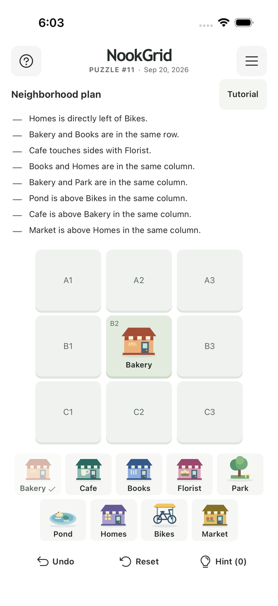

# NookGrid

A free daily brain game. Arrange nine places to match the neighborhood plan.

**[Download NookGrid](https://apps.apple.com/app/id6813274587)** · Free on iPhone and iPad. No account needed.

## How to play

Read the plan, then drag places onto the grid or tap a place and a square. Find the arrangement that fits every relationship.

Play today's puzzle, continue a saved attempt, or explore past puzzles. Progress in dated puzzles saves automatically on this device. The optional Tutorial explains the controls and starts fresh each time you open it. The home streak and expandable month calendar show daily progress and completed puzzles; replaying an older puzzle does not add daily streak credit.

## Website

Play at [nookgrid.com](https://nookgrid.com/) on desktop. Phone-sized screens open the App Store; larger screens retain playable daily, archive and Tutorial links. Embedded pages and browsers without JavaScript show a download link. How to play, support and privacy stay accessible. Browser saves remain on the device; they do not transfer into the app.

## iPhone

NookGrid is available on the [App Store](https://apps.apple.com/us/app/nookgrid/id6813274587). TestFlight is used for upcoming updates. Website and iPhone releases are verified separately.

[Development guide](docs/DEVELOPMENT.md) · [Release guide](docs/RELEASING.md)

## Before a release

After installing dependencies and the Playwright browsers, run `npm run test:release` for the local shared-logic and browser checks. Before publishing, run `npm run check:release` with command-scoped personal GitHub read access. This separate gate requires clean, committed source matching current `origin/main`, plus successful web and iOS jobs in its latest CI run. It reuses those completed checks without rerunning the simulator suite. See the [release guide](docs/RELEASING.md#required-release-gate) for setup and the manual native checklist.
