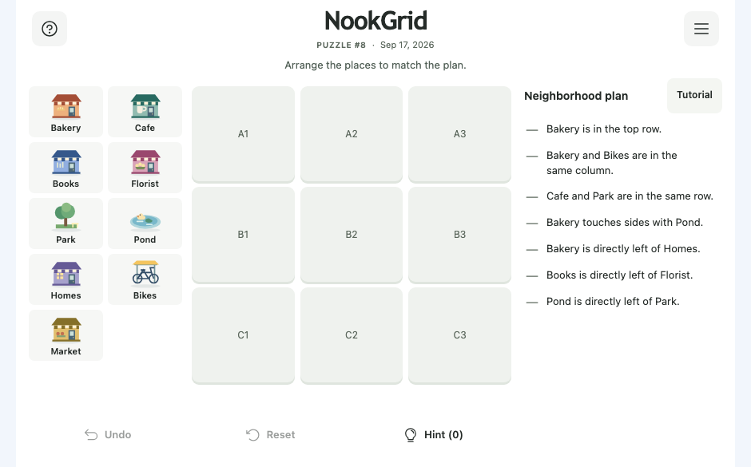

# NookGrid

A free daily brain game. Arrange nine places to match the neighborhood clues.

**[Play NookGrid](https://nookgrid.com/)** · No account needed.

## How to play

Read the clues, then drag places onto the grid or tap a place and a square. Find the arrangement that fits them all.

Start with the Tutorial, try a new puzzle every day, or explore past puzzles. Your progress saves automatically.

## Web

## iPhone

The iPhone app is currently in TestFlight.

[Development guide](docs/DEVELOPMENT.md) · [Release guide](docs/RELEASING.md)
