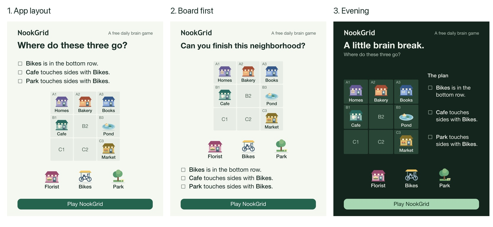

# NookGrid ad creative

Three visuals approved on September 27, 2026. Stored for reuse; approval of the designs does not start an advertising campaign.

| Design | Export | Editable source | Phone preview |
| --- | --- | --- | --- |
| App layout | [PNG](01-app-first.png) | [SVG](01-app-first.svg) | [360px](01-app-first-phone.png) |
| Board first | [PNG](02-board-first.png) | [SVG](02-board-first.svg) | [360px](02-board-first-phone.png) |
| Evening | [PNG](03-evening.png) | [SVG](03-evening.svg) | [360px](03-evening-phone.png) |

All primary exports are **1080 × 1350**. The SVGs contain the artwork and text and can be edited directly. They use System Font, Helvetica Neue or Helvetica for copy and Trebuchet MS for the wordmark. Use the PNGs for the approved appearance when those fonts are unavailable.

## Copy

- App layout: **Where do these three go?**
- Board first: **Can you finish this neighborhood?**
- Evening: **A little brain break.** / **Where do these three go?**
- Category: **A free daily brain game**
- Action: **Play NookGrid**

The three clues are:

1. Bikes is in the bottom row.
2. Cafe touches sides with Bikes.
3. Park touches sides with Bikes.

## Puzzle and artwork

These are composed excerpts from the September 26 puzzle, using the app’s place artwork, board coordinates, palettes and clue markers. Six places are given; Florist, Bikes and Park fill the three empty squares. The images omit unrelated controls and already placed tray pieces. The Evening version lightens the bicycle frame for visibility against the dark background.

The shared game engine verified all six arrangements: exactly one satisfies the clues, and every clue is necessary. The checks and source identity are recorded in [validation.json](validation.json). The action invites players to NookGrid without promising this exact excerpt is the destination puzzle.

Keep the [Phosphor license](phosphor-LICENSE.txt) with the editable artwork.
